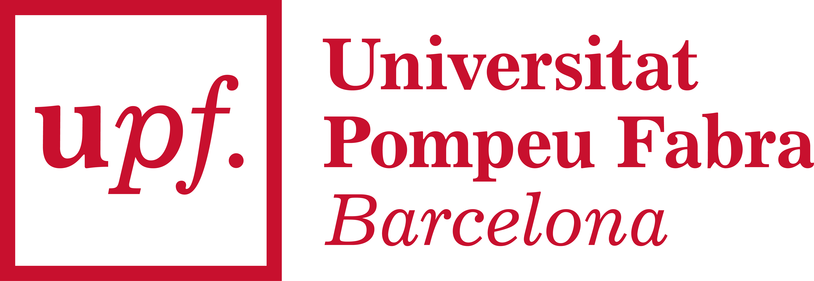
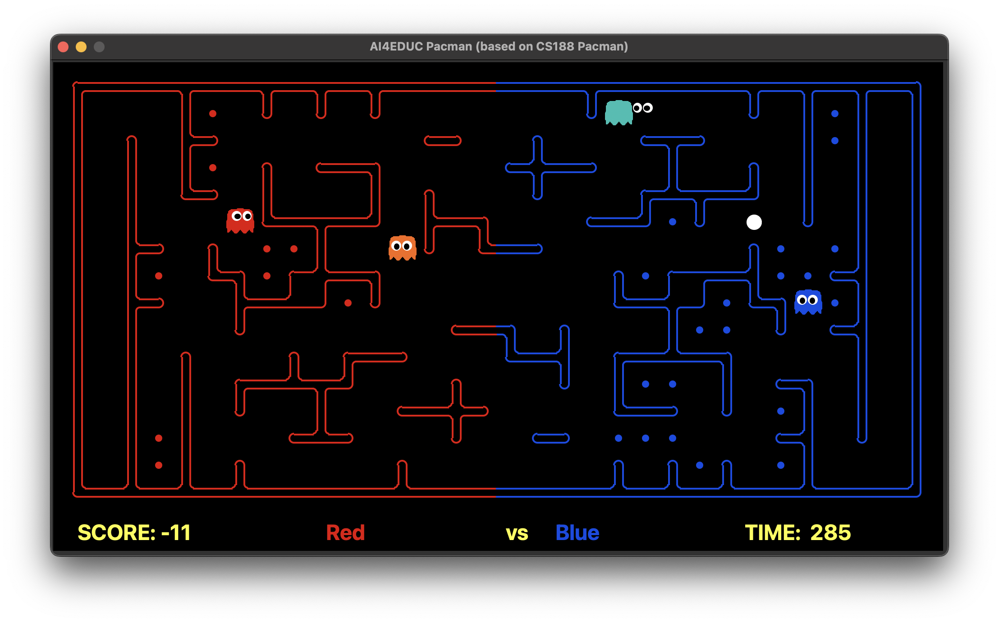
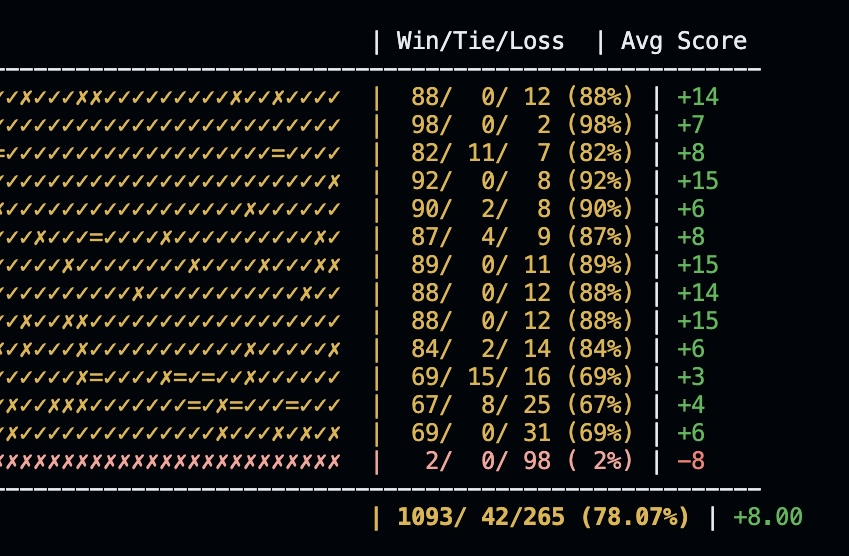
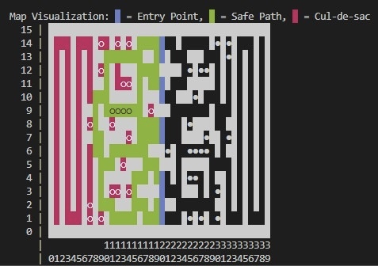

&nbsp;&nbsp;&nbsp;&nbsp;&nbsp;&nbsp;&nbsp;&nbsp;&nbsp;&nbsp;&nbsp;&nbsp;&nbsp;&nbsp;&nbsp;&nbsp;

---

# LaPulga Pacman agent

#### An AI-based agent for the Pacman Capture the Flag competition, part of the Artificial Intelligence course at UPF (2025)

This repository contains our development of an intelligent Pacman agent designed for competitive gameplay in the Pacman Capture the Flag contest environment.



The [contest](contest_info.pdf) involves teams of two Pac-Man agents competing on different maze layouts, where they have to eat food pellets in the opponent's half and bring them back to their home base to score points. When in opponent territory, they are a Pac-Man; and when defending their half, they become a ghost capable of eating opposing Pac-Mans.

As expected from us, our implementation follows a **heuristic-based strategy** using Python logic and rule-based decision-making, performing tuning and high level strategy empirically based on observed performance. While more advanced techniques like reinforcement learning or deep reinforcement learning could potentially learn better/superhuman strategies automatically, such approaches:

- Require treating the contest as a training environment rather than evaluation platform (outisde of the scope of the contest)
- Need significantly more computational resources

So it was a game of trying out strategies, heuristics and parameter choices to get the best performance out of a classical AI agent within the contest constraints.

## Our approach: what we did

### Reproducible environment with `uv`

We improved upon the original contest framework by migrating from `requirements.txt` to a fully reproducible `uv`-based environment in `pyproject.toml`. See the [original template repository](https://github.com/aig-upf/pacman-agent) as reference.

### Simpler testing scripts

We created two simple scripts (`config.sh` and `play.sh` in `scripts/`) that hide the complexity of the original contest commands. These scripts use our default configurations and allow users to test the game easily.

### Unified agent design

Rather than following the baseline approach of creating separate defensive and offensive agent classes, we implemented a **single unified agent class** that handles both roles, in under 500 lines of code.

### Internal simulation infrastructure

Beyond this public repository, we developed an internal simulation framework to facilitate large-scale empirical evaluation of different parameter configurations and strategies. This framework **runs large-scale tournaments** with thousands of games across different map layouts and agent variations, while **parallelizing across CPU cores** for faster evaluation. We used this tool as our reference for performance benchmarking and iterative improvement, and we won't share it publicly to not remove the fun of making your own solutions to the detected challenges for future participants.



### Contest performance optimization

We made our own [fork of the original contest framework](https://github.com/uripont/pacman-contest/) to be able to run our thousands of games faster, [contributing it back to the original respository as well](https://github.com/aig-upf/pacman-contest/pull/4).
During internal profiling, we identified and optimized critical bottlenecks in the original contest implementation (using profiling scripts that we made to measure the execution time of different parts of the original contest), achieving **3-4x speedup** through memory optimization. A nice rabbit hole that we explored to fix our own pain points during agent development.

### Three agent versions

Our development (see [commit history](https://github.com/uripont/pacman-agent/commits/main/)) evolved through several incremental iterations, highighting 3 checkpoints:

1. **[Balanced version (v0.4.5)](https://github.com/uripont/pacman-agent/blob/3eb633f236492af5782271defa97e9bbff624baa/my_team.py)**: Concise, understandable, and performant implementation (less than 500 loc).

2. **[Contest-patched version (current main, v0.4.9)](https://github.com/uripont/pacman-agent/blob/main/my_team.py)**: Adds hardcoded strategic refinements based on what we detected during gameplay analysis (patches to address observed weaknesses in specific scenarios, reducing lost games)

3. **[Promising next steps](https://github.com/uripont/pacman-agent/blob/planning-and-rich-shared-layout/my_team.py)**: We started exploring more advanced techniques for coordinated planning between the two Pac-Mans on our **`planning-and-rich-shared-layout` branch**. Here we started using the 15-second initialization window for static analysis of the maze layout, and implemented a **shared state representation**, enabling **inter-agent communication** via a some class variable modification trick. This, combined with estimation of opponent positions based last known sightings, is a much more robust basis for coordinated strategies in a potentially much less reactive way (more planned). We expect a finalized version of this approach to outperform our contest submission significantly with a simplified (but less error-prone) strategy logic.



We did not have time to fully develop this last approach on time for the contest, but we did not need it to be among the top teams and earning the best possible grade.

## Setup

1. Clone the repository and navigate to the project directory (use `--recursive` to include contest submodules):

```bash
git clone --recursive <repository-url>
cd pacman-agent
```

2. Create and activate the virtual environment:

```bash
uv sync
source .venv/bin/activate
```

On Windows:

```bash
uv sync
.venv\Scripts\activate
```

### Running the agent

You can quickly set up and run a contest match using the provided scripts:

```bash
scripts/config.sh
scripts/play.sh
```

## Acknowledgments

This project was developed by Jorge Camacho and Oriol Pont as part of the EUTOPIA Pacman Capture-the-Flag competition. We had a lot of fun working on it, especially when overcoming different interesting technical challenges along the way. It has been one of our most enjoyable university projects to date.

We share this codebase publicly not only because it was required by our professors in order to participate in the contest, but also because we are aware that it is far from being a "solution" to the (toy) problem.
